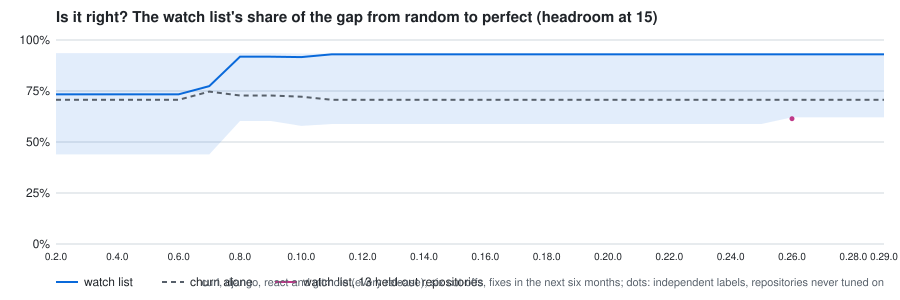
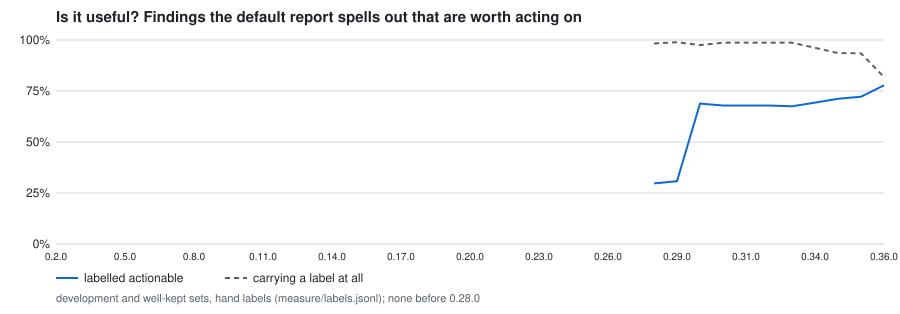
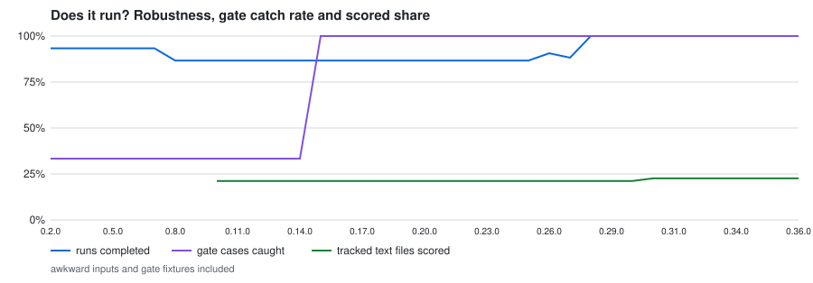
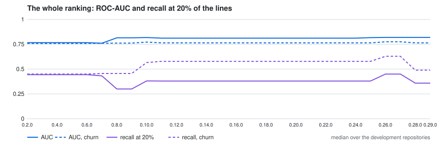
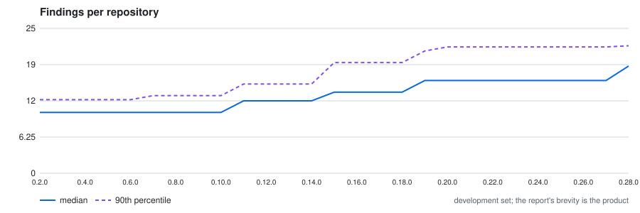
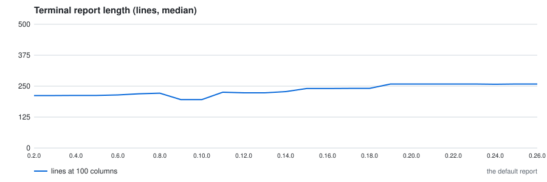
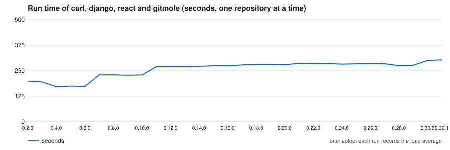
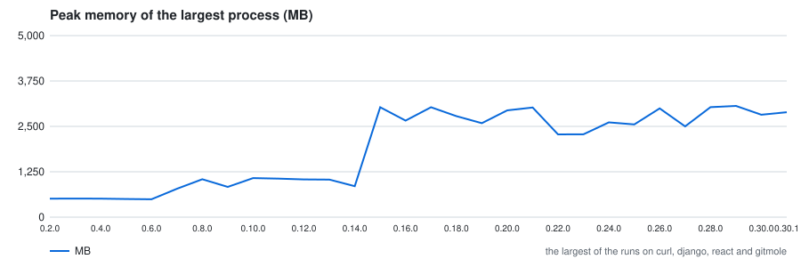

# Measurement history

Every release of gitmole run through the harness of [measurement.md](https://github.com/antvinni/gitmole/blob/main/docs/measurement.md); back to [the README](https://github.com/antvinni/gitmole#readme). Regenerated by `python -m gitmole.measure report` from the records in [docs/measurements/](https://github.com/antvinni/gitmole/tree/main/docs/measurements).

Each release runs from its own source over the development set (curl, django and react at the example commits, and gitmole itself), the awkward inputs and the gate fixtures, one repository at a time, with the reference date fixed at 2026-09-17. What it produces is scored by the current definitions, which stay fixed across the history: the ranking is the release's own, rebuilt at six cut-offs by its own backtest, and the outcome is the files a fix commit touched in the six months after each cut-off. The holdout is not read here: it runs only for the release a note claims is more effective. A release that crashed or timed out on a development repository is drawn at the bottom of every graph with a red cross, and its row says why. The graphs draw every release over the same four repositories, curl, django, react and gitmole, so a repository joining the development set is not a move; the table and the dashboard use the whole set. The first three graphs are the ones the README shows: is the ranking right, are the findings worth acting on, does it run.

## What the history shows

- **The ranking improved once, at 0.8.0, and has held since.** Releases 0.2.0 to 0.7.0 ranked by a factor
  product and barely changed its code; their headroom is 0.73 to 0.77, a little above churn alone (0.71 to
  0.75), with 9 wins, 1 loss and 8 ties against it over eighteen cut-offs. 0.8.0 switched to revisions ×
  lines of code and read the checked-out branch's history instead of every ref's: headroom 0.92, 13 wins, no loss and 5 ties, ROC-AUC 0.76 to 0.81. With three development
  repositories the intervals are wide (0.60 to 0.94 at 0.8.0), and 0.92 sits inside 0.7.0's interval, so by
  this page's own rule it is not yet a counted move; it is the largest change in the history and the one the
  holdout was run to check.
- **The price of that ranking is reading effort.** Recall at 20% of the lines fell from 44% to 30% at 0.8.0,
  since a size-weighted list names large files first, and rose to 38% at 0.10.0, when one classifier began
  deciding for every table which files enter the pool.
- **Everything since 0.11.0 added output rather than effectiveness.** From 0.11.0 to 0.25.0 the ranking
  numbers do not move; findings per repository grew from 10.5 to 16 (median) and from 13.4 to 21.8 (p90), and
  the report from about 212 to 258 lines. That is the cost side of the new rules, which the page's noise
  budget asks to be conscious of.
- **The gate caught all three of its cases from 0.15.0,** when the Trojan Source and submodule checks
  arrived; before that it caught the committed key only.
- **Peak memory tripled at 0.15.0,** from about 850 MB to about 3 GB on react. The per-step records 0.26.0
  added put it in the secrets step (betterleaks peaks at 2,994 MB there), which 0.15.0 extended to the
  objects no ref reaches. jscpd's duplicate search is next at about 1 GB. Run time grew from about 200 to 285
  seconds for the three development repositories.
- **Robustness has one standing failure and one since 0.8.0.** Every release crashes on an empty
  repository (`git log` fails before the first commit), and from 0.8.0 git-sizer fails on a shallow clone.
  0.26.0 added a third: its per-step wrapper ran as `python -m`, which searches the analysed repository first,
  so on gitmole's own history every step imported that repository's older gitmole and failed. The measurement
  found it; the release after 0.26.0 fixes it. 0.28.0 fixes the other two: an empty repository is refused
  with exit code 2 and a one-line reason, and a shallow clone skips git-sizer and says why, so robustness
  is 21 of 21.
- **Stability reads 1.00 in every release.** Fifty commits span three days on curl and at most seven weeks on
  react, too short for the top fifteen to change; the measure needs a longer horizon to say anything.
- **No release crashed on a development repository,** so no point sits at the bottom of the graphs.
- **0.26.0's small ranking change is the UTC fix.** Its backtest cuts off at a UTC midnight rather than the
  machine's, which moves a handful of commits across each cut-off: 12 wins and 6 ties instead of 13 and 5,
  recall at 20% 45% instead of 38%.
- **The current release's own checks** (the dashboard at the end of this page): determinism holds across a
  time zone and a locale; every description check agrees (signing is not checked, since gpg was not
  installed); of 50 numeric thresholds 21 are flat, 21 never fire on these repositories and 6 are fragile,
  `tight_coupling`'s 80 among them, which keeps its count at ±10% but names different files. The hook's
  coupling warning is the weakest result here: at file granularity its precision is 0% on django, 17% on
  curl and 43% on react, and on react it warns on a third of complete commits, where every warning is a
  false alarm. ROSE reported 66% precision at function granularity, so the hook's warning does not yet
  earn the ROSE figure its docstring cites.
- **The holdout says the development set flatters the ranking.** 0.26.0 was run once over the thirteen
  ApacheJIT repositories, scored against their independent labels: median headroom 0.61 (interval 0.34 to
  0.80) against 0.93 on the development set, and against churn alone 23 wins, 19 losses and 36 ties, close
  to a draw. Recall at 20% of the lines is 40%. The development set, where the thresholds were chosen, is
  the optimistic end.
- **The gate fires on well-kept projects.** Three of the four CNCF graduated projects got a critical: etcd
  for private keys in files named `*.key.insecure` under `hack/scripts-dev/`, containerd for a `password`
  field in generated protobuf code, prometheus for key-shaped strings in `cmd/tsdb/testdata.20k`. None is
  labelled yet, but on a first reading each is a fixture or generated code, which would put the false
  alarm rate at three in four where the page asks for near zero. This is the most urgent thing the
  measurement found. The labels confirmed all three, and 0.28.0 is at none of four (below).
- **0.28.0's headroom fell because the development set widened, not because the ranking changed.**
  Ghidra and binutils-gdb joined curl, django and react (measure/corpus.json, moves), so that intervals
  over repositories could narrow. On the three original repositories every number is the same as in
  0.27.0 (curl 0.93, django 0.93, react 0.62). Ghidra (0.36, 2 wins and 3 losses against churn) and
  binutils-gdb (0.55) bring the median to 0.62, with an interval of 0.36 to 0.93, and churn's to 0.52.
  The run time of the set rose from 284 to 674 seconds for the same reason; binutils-gdb alone takes six
  minutes. Compare 0.28.0 onwards with each other, not with the rows above it.
- **0.28.0 acted on the measurement rather than adding rules.** The 0.28.0 findings sheet was labelled
  (182 findings, one labeller). Three rules came out broken: `secrets_in_source`, `secrets_possible` and
  `trojan_source`. The false alarms behind them were a documentation URI, a CI database password, right-to-left
  marks in Arabic locale strings, and the bytes of a generated protobuf descriptor. Each was retuned by
  shape, and `hotspot_dominance`, which never fired, was deleted. The criticals went from 3 of 4 well-kept
  repositories to none. On the development set only react keeps one: a token-shaped string in an
  unreachable blob, which has no path that would say what it is. The gate still catches 3 of 3.
  Findings per repository fell from 19.5 to 18.5 (median), and the report from 296 to 278 lines.
- **What the ranking is for** is now said plainly in validation.md: churn weighted by size. At the top
  it is a few files ahead of churn, over the whole pool it is better (ROC-AUC), and per line read it is
  worse. A twelve-month recency variant won on the development set and drew on the holdout, so it was
  not shipped.
- **Peak memory is highest on prometheus,** about 4 GB, in the well-kept set, which the memory graph does not
  plot. The graph plots the development set, where react's 3 GB is still the peak.
- **0.29.0 retuned the hook's coupling warning rather than cutting it.** A companion is now a scored source
  file that moved in at least 70% of the touched file's changesets, over at least twenty of them (ROSE's
  directed confidence), where it was any file changing with it half the time by the symmetric degree. It
  was chosen among eighteen thresholds on the development set, then read once on the thirteen held-out
  repositories: precision 0.26 -> 0.60 on development and 0.29 -> 0.49 on the holdout, and complete commits
  alarmed 10% -> 3% and 14% -> 4%. As shipped, counting changesets and naming only scored source files, it
  is right 62% of the time on development and 54% on the holdout, with 3% of complete commits alarmed; see
  validation.md. Companions have to be scored files because of binutils-gdb: over the full history, every
  change there once touched a ChangeLog, and 75% of its complete commits alarmed until that rule was added.
- **0.29.0's other changes follow the labels.** A README heading about security is the policy a project
  points to (containerd). A stylesheet's `@import` loads an npm package (prometheus). A generated marker
  below a licence header counts (Ghidra's Bison and flex parsers). The rest of the parked classification
  work has no labelled finding behind it and stays parked.
- **The osv-scanner step holds prometheus's peak,** 4 GB, not gitmole: osv-scanner 2.6 keeps about 1.3 GB
  live per Go module with a large dependency graph (`documentation/examples/remote_storage/go.mod`), offline
  and with or without `--no-resolve`. A Go memory limit and a single thread do not lower it. gitmole's own
  steps stay under 1.1 GB.
- **Stability over 50 commits is joined by carry-over across six months** from 0.29.0, the half of the
  question fifty commits cannot answer. Its first reading is 0.94: from one cut-off to the next, six months
  later, the top fifteen keeps nearly all its files (0.90 on curl and Ghidra, 1.00 on binutils-gdb). A list
  ranked by whole-history revisions × lines hardly moves in half a year. The recency variant that would
  move it did not beat it on the holdout (validation.md), so this is what the ranking is, not a fault to fix.
- **Ghidra's brain methods no longer lead with the Bison parser** (`slghparse.cc`'s `yyparse`), the one
  labelled finding the deeper generated markers answer: 241 functions where there were 250. containerd
  loses its false `repo_policy` finding. Nothing else in the record moved.
- **0.30.0 asked whether the findings are worth acting on, not only whether they are true.** Nine rules
  whose labelled findings were all true and none actionable (repository health, knowledge loss, authors
  gone, minor contributors, reverts, duplication, stale files, component coupling, secrets only in tests)
  are now named in one line of the default report. The report spells out 7.5 findings per repository where
  it spelled out 18.5, and runs 220 lines where it ran 278. Of what it spells out, 69% is labelled
  actionable, where it was 31%. That jump is by construction: the nine rules were chosen from these same
  labels on these same repositories, so it shows the mechanism works, not that the report became more
  useful in general. The test is labels the set was not chosen from, a second labeller's sample
  (`measure/labels-second.jsonl`) and new findings on new repositories. Every label so far is one
  labeller's, and that labeller wrote the rules.
- **The long graphs now draw every release over the same four repositories** (curl, django, react and
  gitmole), so the fall in headroom at 0.28.0 and the jump in run time, both from Ghidra and binutils-gdb
  joining the development set, no longer show as moves. On the four, headroom is 0.93 and run time about
  275 seconds from 0.26.0 to 0.30.0. The table above and the dashboard below still use the whole set.
- **0.30.1 fixed three classifications without adding a rule** (the first patch release under the written
  semver rule in development.md). A `packages/` inside a top-level directory is vendored only when no
  workspace manifest declares it, so react's `compiler/packages/` is react's own code again: the scored
  share of the development set rose from 21% to 23%, react's watch list names the compiler, and its
  backtest at the 2023-09 cut-off, where the merged-in compiler history is all the tree has, scores 26
  files where it scored none. Headroom 0.62 and carry-over 0.94 -> 0.90 move only through react. An ELF
  relocatable object is not an executable (Ghidra's two `.elf` disassembler inputs; six DLLs remain).
  Identities merge by what the history's own names say instead of a list of common first names: a word
  two people's full names share (David Smith, David Sanders), or a bare given name (Jack, George), no
  longer joins anyone by name alone. Over the 23 measurement clones that splits about 280 groups the list
  let through (binutils-gdb's five Jasons, django's Thomases and Jannis Leidel's 895 commits beside
  Jannis Vajen's) and makes two wrong merges, a lowercase `steve` joining the one Steve of django and of
  kafka. 22 findings whose wording changed were labelled; each kept its verdict.
- **Report length was measured in a forced terminal all along.** Every record from 0.2.0 to 0.30.0 ran
  with `FORCE_COLOR` inherited from the shell that started it, so the report printed its banner and 80
  columns whatever `COLUMNS` said. A run started without it printed 11 lines fewer for the same code.
  From 0.30.1 the harness sets the terminal itself, and the length column says "80 columns, banner
  included", which is what it always measured.
- **0.31.0 pins the toolchain and moves nothing else.** Every number in the record is the same as 0.30.1's
  on every repository, findings, ranking, robustness and the gate alike; only the wall time (689 s against
  718) and peak memory (3,034 MB against 2,889) differ, and those vary between runs on one machine. That is
  what a release that only fixes where the tools come from should look like.
  What it changes is what a record means: the tools are installed with gitmole at the versions
  `gitmole/tools.py` names, so a row of this table now describes one toolchain rather than whichever
  versions the machine happened to have. Records before it say which versions ran (`run.tools`) but were
  measured against whatever Homebrew had that week, so a report-shaping change in scc, betterleaks or
  jscpd is a possible cause for any move in the rows above this one.
- **0.32.0 turns the structure step on, and the measurement found what that cost.** The tree-sitter grammars
  ship with gitmole, so the step that reads nesting, debt markers and the import graph runs on every install
  with Python 3.10 or newer, and the seven rules behind it reach the measurement for the first time. They add
  one to six findings per repository, 35 over the set, and every one of them is on the findings sheet rather
  than in the default report: no label has reached these rules, so the report names them in a line of its own
  ("2 more from the structure step, not labelled yet") and the actionable share still measures only what it
  spells out. The watch list does change, for the better: a file's reasons now include what the parser saw
  (`http_rw_hd() nested 7 deep`) in place of a weaker one. The cost is two to eight report lines per
  repository, 13 seconds over the whole set (689 to 702) and no measurable memory: the step runs beside the
  others, not after them. Ghidra pays the most, 39 seconds to 46.
- **Running it everywhere cost three fixes, none of which a test had caught.** The step had been opt-in, so
  nothing had ever run it on an awkward input or under the determinism check. `structure._blobs` passed every
  tracked path to `git ls-files`, about 1.4 MB of arguments for Ghidra's 12,000 deep Java paths where macOS
  allows 1 MB, so the step died with "Argument list too long" on the repository it matters most for, and an
  empty path list made git list the whole index, which is how the binary-only fixture met a `.bin` and
  crashed. A path git hands over as surrogate escapes reached the JSON export, which writes UTF-8, and killed
  the whole run on the non-UTF-8-path fixture; the step now writes the replaced form the other steps write,
  which is also the form the tables it joins with hold. And the suffix index behind import resolution was
  built by walking a set, so where two files answer one module name (django has two `json.py`) the winner
  followed the hash seed: two runs of the same commit gave different import graphs and determinism read "no"
  on django. Each has a test that fails against the old code. The shipped record is the run after all three:
  robustness 21 of 21, determinism yes on both repositories, the gate 3 of 3.
- **The new rules' thresholds are the fittest part of the release.** Sensitivity now covers them: eleven
  thresholds are fragile where eight were, three of the new ones among them (`commented_out_code`'s ten
  lines, `hidden_coupling`'s degree of 60, `swallowed_errors`'s count of five), and `deep_nesting`'s five
  levels is moderate. None was chosen against a label, which is the other reason these findings stay out of
  the default report until the sheet's 35 are labelled.

## By release

Headroom is (hits − random) / (perfect − random) at 15, the median over the development repositories, with a bootstrap interval over repositories. ▲ or ▼ marks a release whose value left the previous release's interval, the only move that counts. W/L/T is the watch list against churn alone at each cut-off. Bug magnets is how much more often the files the rule named were fixed again than unnamed files in the same deciles of the list's own score.

| release | headroom | churn | W/L/T | AUC | recall 20% | stable | magnets | findings | lines | scored | robust | gate | seconds | MB | note |
|---|---:|---:|---|---:|---:|---:|---:|---:|---:|---:|---:|---:|---:|---:|---|
| 0.2.0 | 0.73 [0.44, 0.94] | 0.71 | 9/1/8 | 0.77 | 44% | 1.00 | - | 10.5/12.7 | 212 | - | 14/15 | 1/3 | 199 | 510 | awkward-empty: subprocess.CalledProcessError: Command '['git', 'log', '--format=%ct'… |
| 0.3.0 | 0.73 [0.44, 0.94] | 0.71 | 9/1/8 | 0.77 | 44% | 1.00 | - | 10.5/12.7 | 212 | - | 14/15 | 1/3 | 195 | 512 | awkward-empty: subprocess.CalledProcessError: Command '['git', 'log', '--format=%ct'… |
| 0.4.0 | 0.73 [0.44, 0.94] | 0.71 | 9/1/8 | 0.77 | 44% | 1.00 | - | 10.5/12.7 | 212.5 | - | 14/15 | 1/3 | 172 | 509 | awkward-empty: subprocess.CalledProcessError: Command '['git', 'log', '--format=%ct'… |
| 0.5.0 | 0.73 [0.44, 0.94] | 0.71 | 9/1/8 | 0.77 | 44% | 1.00 | - | 10.5/12.7 | 212.5 | - | 14/15 | 1/3 | 175 | 499 | awkward-empty: subprocess.CalledProcessError: Command '['git', 'log', '--format=%ct'… |
| 0.6.0 | 0.73 [0.44, 0.94] | 0.71 | 9/1/8 | 0.77 | 44% | 1.00 | - | 10.5/12.7 | 214.5 | - | 14/15 | 1/3 | 173 | 492 | awkward-empty: subprocess.CalledProcessError: Command '['git', 'log', '--format=%ct'… |
| 0.7.0 | 0.77 [0.44, 0.94] | 0.75 | 9/1/8 | 0.76 | 43% | 1.00 | - | 10.5/13.4 | 219 | - | 14/15 | 1/3 | 230 | 783 | awkward-empty: subprocess.CalledProcessError: Command '['git', 'log', '--format=%ct'… |
| 0.8.0 | 0.92 [0.60, 0.94] | 0.73 | 13/0/5 | 0.81 | 30% | 1.00 | 2.31 | 10.5/13.4 | 221.5 | - | 13/15 | 1/3 | 230 | 1045 | awkward-empty: subprocess.CalledProcessError: Command '['git', 'log', '--format=%ct'…; awkward-shallow: 1 step(s) failed |
| 0.9.0 | 0.92 [0.60, 0.94] | 0.73 | 13/0/5 | 0.81 | 30% | 1.00 | 2.31 | 10.5/13.4 | 195.5 | - | 13/15 | 1/3 | 228 | 834 | awkward-empty: subprocess.CalledProcessError: Command '['git', 'log', '--format=%ct'…; awkward-shallow: 1 step(s) failed |
| 0.10.0 | 0.92 [0.58, 0.93] | 0.72 | 13/0/5 | 0.82 | 38% | 1.00 | 1.95 | 10.5/13.4 | 195.5 | 21% | 13/15 | 1/3 | 230 | 1075 | awkward-empty: subprocess.CalledProcessError: Command '['git', 'log', '--format=%ct'…; awkward-shallow: 1 step(s) failed |
| 0.11.0 | 0.93 [0.59, 0.93] | 0.71 | 13/0/5 | 0.81 | 38% | 1.00 | 2.00 | 12.5/15.4 | 225.5 | 21% | 13/15 | 1/3 | 269 | 1062 | awkward-empty: subprocess.CalledProcessError: Command '['git', 'log', '--format=%ct'…; awkward-shallow: 1 step(s) failed |
| 0.12.0 | 0.93 [0.59, 0.93] | 0.71 | 13/0/5 | 0.81 | 38% | 1.00 | 2.04 | 12.5/15.4 | 223 | 21% | 13/15 | 1/3 | 270 | 1038 | awkward-empty: subprocess.CalledProcessError: Command '['git', 'log', '--format=%ct'…; awkward-shallow: 1 step(s) failed |
| 0.13.1 | 0.93 [0.59, 0.93] | 0.71 | 13/0/5 | 0.81 | 38% | 1.00 | 2.04 | 12.5/15.4 | 223 | 21% | 13/15 | 1/3 | 270 | 1034 | awkward-empty: subprocess.CalledProcessError: Command '['git', 'log', '--format=%ct'…; awkward-shallow: 1 step(s) failed |
| 0.14.0 | 0.93 [0.59, 0.93] | 0.71 | 13/0/5 | 0.81 | 38% | 1.00 | 2.04 | 12.5/15.4 | 228 | 21% | 13/15 | 1/3 | 272 | 853 | awkward-empty: subprocess.CalledProcessError: Command '['git', 'log', '--format=%ct'…; awkward-shallow: 1 step(s) failed |
| 0.15.0 | 0.93 [0.59, 0.93] | 0.71 | 13/0/5 | 0.81 | 38% | 1.00 | 2.04 | 14/19.1 | 240.5 | 21% | 13/15 | 3/3 | 274 | 3026 | awkward-empty: subprocess.CalledProcessError: Command '['git', 'log', '--format=%ct'…; awkward-shallow: 1 step(s) failed |
| 0.16.0 | 0.93 [0.59, 0.93] | 0.71 | 13/0/5 | 0.81 | 38% | 1.00 | 2.04 | 14/19.1 | 240.5 | 21% | 13/15 | 3/3 | 274 | 2660 | awkward-empty: subprocess.CalledProcessError: Command '['git', 'log', '--format=%ct'…; awkward-shallow: 1 step(s) failed |
| 0.17.0 | 0.93 [0.59, 0.93] | 0.71 | 13/0/5 | 0.81 | 38% | 1.00 | 2.04 | 14/19.1 | 241 | 21% | 13/15 | 3/3 | 279 | 3026 | awkward-empty: subprocess.CalledProcessError: Command '['git', 'log', '--format=%ct'…; awkward-shallow: 1 step(s) failed |
| 0.18.0 | 0.93 [0.59, 0.93] | 0.71 | 13/0/5 | 0.81 | 38% | 1.00 | 2.04 | 14/19.1 | 241 | 21% | 13/15 | 3/3 | 281 | 2782 | awkward-empty: subprocess.CalledProcessError: Command '['git', 'log', '--format=%ct'…; awkward-shallow: 1 step(s) failed |
| 0.19.0 | 0.93 [0.59, 0.93] | 0.71 | 13/0/5 | 0.81 | 38% | 1.00 | 2.04 | 16/21.1 | 258.5 | 21% | 13/15 | 3/3 | 282 | 2588 | awkward-empty: subprocess.CalledProcessError: Command '['git', 'log', '--format=%ct'…; awkward-shallow: 1 step(s) failed |
| 0.20.0 | 0.93 [0.59, 0.93] | 0.71 | 13/0/5 | 0.81 | 38% | 1.00 | 2.04 | 16/21.8 | 258.5 | 21% | 13/15 | 3/3 | 280 | 2940 | awkward-empty: subprocess.CalledProcessError: Command '['git', 'log', '--format=%ct'…; awkward-shallow: 1 step(s) failed |
| 0.21.0 | 0.93 [0.59, 0.93] | 0.71 | 13/0/5 | 0.81 | 38% | 1.00 | 2.04 | 16/21.8 | 258.5 | 21% | 13/15 | 3/3 | 287 | 3020 | awkward-empty: subprocess.CalledProcessError: Command '['git', 'log', '--format=%ct'…; awkward-shallow: 1 step(s) failed |
| 0.22.0 | 0.93 [0.59, 0.93] | 0.71 | 13/0/5 | 0.81 | 38% | 1.00 | 2.04 | 16/21.8 | 258.5 | 21% | 13/15 | 3/3 | 285 | 2279 | awkward-empty: subprocess.CalledProcessError: Command '['git', 'log', '--format=%ct'…; awkward-shallow: 1 step(s) failed |
| 0.23.0 | 0.93 [0.59, 0.93] | 0.71 | 13/0/5 | 0.81 | 38% | 1.00 | 2.04 | 16/21.8 | 258.5 | 21% | 13/15 | 3/3 | 286 | 2282 | awkward-empty: subprocess.CalledProcessError: Command '['git', 'log', '--format=%ct'…; awkward-shallow: 1 step(s) failed |
| 0.24.0 | 0.93 [0.59, 0.93] | 0.71 | 13/0/5 | 0.81 | 38% | 1.00 | 2.04 | 16/21.8 | 257.5 | 21% | 13/15 | 3/3 | 283 | 2610 | awkward-empty: subprocess.CalledProcessError: Command '['git', 'log', '--format=%ct'…; awkward-shallow: 1 step(s) failed |
| 0.25.0 | 0.93 [0.59, 0.93] | 0.71 | 13/0/5 | 0.82 | 38% | 1.00 | 2.03 | 16/21.8 | 258.5 | 21% | 13/15 | 3/3 | 284 | 2553 | awkward-empty: subprocess.CalledProcessError: Command '['git', 'log', '--format=%ct'…; awkward-shallow: 1 step(s) failed |
| 0.26.0 | 0.93 [0.62, 0.93] | 0.71 | 12/0/6 | 0.82 | 45% | 1.00 | 2.06 | 16/21.8 | 258.5 | 21% | 29/32 | 3/3 | 286 | 2994 | awkward-empty: subprocess.CalledProcessError: Command '['git', 'log', '--format=%ct'…; awkward-shallow: 1 step(s) failed; gitmole: 9 step(s) failed |
| 0.27.0 | 0.93 [0.62, 0.93] | 0.71 | 12/0/6 | 0.82 | 45% | 1.00 | 2.06 | 16/21.8 | 258.5 | 21% | 15/17 | 3/3 | 284 | 2501 | awkward-empty: subprocess.CalledProcessError: Command '['git', 'log', '--format=%ct'…; awkward-shallow: 1 step(s) failed |
| 0.28.0 | 0.62 [0.36, 0.93] | 0.52 | 17/4/9 | 0.82 | 36% | 1.00 | 3.86 | 18.5/22 | 278 | 21% | 21/21 | 3/3 | 674 | 3029 |  |
| 0.29.0 | 0.62 [0.36, 0.93] | 0.52 | 17/4/9 | 0.82 | 36% | 1.00 | 3.86 | 18.5/22 | 278 | 21% | 21/21 | 3/3 | 680 | 3064 |  |
| 0.30.0 | 0.62 [0.36, 0.93] | 0.52 | 17/4/9 | 0.82 | 36% | 1.00 | 3.86 | 18.5/22 | 220.5 | 21% | 21/21 | 3/3 | 709 | 2821 |  |
| 0.30.1 | 0.62 [0.36, 0.93] | 0.52 | 17/4/9 | 0.82 | 36% | 1.00 | 3.86 | 18.5/22 | 220.5 | 23% | 21/21 | 3/3 | 718 | 2889 |  |
| 0.31.0 | 0.62 [0.36, 0.93] | 0.52 | 17/4/9 | 0.82 | 36% | 1.00 | 3.86 | 18.5/22 | 220.5 | 23% | 21/21 | 3/3 | 689 | 3034 |  |
| 0.32.0 | 0.62 [0.36, 0.93] | 0.52 | 17/4/9 | 0.82 | 36% | 1.00 | 3.86 | 23.5/27.5 | 224 | 23% | 21/21 | 3/3 | 697 | 3037 |  |

## The dashboard for 0.32.0

| | set | value |
|---|---|---|
| median headroom at 15 | holdout | not run for this record |
| median headroom at 15 | development | 0.62 |
| recall at 20% of lines | development | 36% |
| top-15 stability over 50 commits | development | 1.00 |
| top-15 carried over from one cut-off to the next, six months | development | 0.90 |
| findings per repository, median and p90 | development | 23.5 and 27.5 |
| findings the default report spells out that are labelled actionable | development and well-kept | 68% of 79, 99% labelled |
| rules sound, broken and undecided | labelled sample | broken 3, sound 3, undecided 26, unlabelled 7 |
| repositories with a critical labelled false | well-kept | 0 of 4 fired a critical |
| wall time and peak memory | development | 697 s, 3037 MB |
| scored share of tracked files | development | 23% |
| unexplained description disagreements | development | 0 |

### Threshold sensitivity

48 numeric thresholds across the rules, each moved 10, 25 and 50% either side on the development set: 28 flat, 11 fragile, 1 moderate, 6 silent, 2 untested. None of them records where its value came from, so each counts as fitted until a line beside it says otherwise.

| rule | threshold | default | verdict | findings at −10% / shipped / +10% |
|---|---|---:|---|---|
| agent_instructions_drift | min_months | 6 | fragile | 1 / 0 / 0 |
| bug_magnets | min_recent | 3 | fragile | = / 5 / = |
| commented_out_code | min_lines | 10 | fragile | 3 / 3 / 2 |
| complexity_growth | min_growers | 3 | fragile | = / 0 / = |
| complexity_growth | min_pct | 25 | fragile | 1 / 0 / 0 |
| component_coupling | min_degree | 30 | fragile | 3 / 2 / 2 |
| hidden_coupling | min_degree | 60 | fragile | 5 / 5 / 4 |
| knowledge_islands | min_share | 0.9 | fragile | 2 / 2 / 1 |
| swallowed_errors | min_count | 5 | fragile | 3 / 3 / 2 |
| tangled_commits | min_share | 0.02 | fragile | 1 / 1 / 0 |
| tight_coupling | min_degree | 80 | fragile | 5 / 5 / 5 |
| deep_nesting | min_nesting | 5 | moderate | 5 / 5 / 5 |
| authors_gone | min_files | 5 | flat | 5 / 5 / 5 |
| brain_methods | min_ccn | 15 | flat | 5 / 5 / 5 |
| brain_methods | min_lines | 100 | flat | 5 / 5 / 5 |
| bug_magnets | warn_at | 5 | flat | 5 / 5 / 5 |
| debt_in_hotspots | min_markers | 3 | flat | = / 4 / = |
| debt_in_hotspots | top_n | 10 | flat | 4 / 4 / 4 |
| deep_nesting | min_bumps | 3 | flat | = / 5 / = |
| deep_nesting | top_n | 10 | flat | 5 / 5 / 5 |
| duplication | min_lines | 30 | flat | 3 / 3 / 3 |
| hidden_coupling | min_resolved | 0.6 | flat | 5 / 5 / 5 |
| hidden_coupling | min_revs | 5 | flat | 5 / 5 / 5 |
| knowledge_islands | min_fraction | 0.01 | flat | 2 / 2 / 2 |
| knowledge_islands | min_lines | 200 | flat | 2 / 2 / 2 |
| knowledge_loss | min_share | 0.1 | flat | 4 / 4 / 4 |
| knowledge_loss | warn_share | 0.3 | flat | 4 / 4 / 4 |
| minor_contributors | min_minor | 5 | flat | 5 / 5 / 5 |
| minor_contributors | top_n | 10 | flat | 5 / 5 / 5 |
| minor_contributors | warn_at | 10 | flat | 5 / 5 / 5 |
| reverts | min_count | 5 | flat | 5 / 5 / 5 |
| reverts | min_share | 0.05 | flat | 5 / 5 / 5 |
| reverts | warn_share | 0.1 | flat | 5 / 5 / 5 |
| stale_files | months | 12 | flat | 4 / 4 / 4 |
| stale_files | share | 0.3 | flat | 4 / 4 / 4 |
| swallowed_errors | top_n | 10 | flat | 3 / 3 / 3 |
| tangled_commits | min_count | 5 | flat | 1 / 1 / 1 |
| tight_coupling | min_revs | 5 | flat | 5 / 5 / 5 |
| truck_factor | area_files | 10 | flat | 5 / 5 / 5 |
| truck_factor | min_files | 20 | flat | 5 / 5 / 5 |

### Description checks

| repository | check | gitmole | second count | by |
|---|---|---:|---:|---|
| binutils-gdb | commits in the history | 127348 | 127348 | git rev-list --count HEAD |
| binutils-gdb | lines per file | 38587 | 38587 | newlines counted in each file scc measured |
| binutils-gdb | tracked text files classified | 43367 | 43367 | git grep -I (tracked, not binary) |
| binutils-gdb | signed commits among the last 200 (not checked) | 12 | None | git log --format=%G? (unavailable: gpg is not installed) |
| curl | commits in the history | 39758 | 39758 | git rev-list --count HEAD |
| curl | lines per file | 2286 | 2286 | newlines counted in each file scc measured |
| curl | tracked text files classified | 4512 | 4512 | git grep -I (tracked, not binary) |
| curl | signed commits among the last 200 (not checked) | 186 | None | git log --format=%G? (unavailable: gpg is not installed) |
| django | commits in the history | 34933 | 34933 | git rev-list --count HEAD |
| django | lines per file | 4356 | 4356 | newlines counted in each file scc measured |
| django | tracked text files classified | 5069 | 5069 | git grep -I (tracked, not binary) |
| django | signed commits among the last 200 (not checked) | 11 | None | git log --format=%G? (unavailable: gpg is not installed) |
| ghidra | commits in the history | 18498 | 18498 | git rev-list --count HEAD |
| ghidra | lines per file | 17976 | 17976 | newlines counted in each file scc measured |
| ghidra | tracked text files classified | 19154 | 19154 | git grep -I (tracked, not binary) |
| ghidra | signed commits among the last 200 (not checked) | 0 | None | git log --format=%G? (unavailable: gpg is not installed) |
| react | commits in the history | 21703 | 21703 | git rev-list --count HEAD |
| react | lines per file | 7015 | 7015 | newlines counted in each file scc measured |
| react | tracked text files classified | 7192 | 7192 | git grep -I (tracked, not binary) |
| react | signed commits among the last 200 (not checked) | 200 | None | git log --format=%G? (unavailable: gpg is not installed) |

### The hook's coupling warning, replayed

Zimmermann et al.'s experiments at file granularity: leave one file out of a commit and see whether the warning names it (precision, and feedback: the share of queries that warn), and a complete commit, where any warning is a false alarm. ROSE's file-level figures are the bar.

| repository | queries | feedback | precision | complete commits | closure false alarms |
|---|---:|---:|---:|---:|---:|
| binutils-gdb | 745 | 18% | 57% | 165 | 11% |
| curl | 1954 | 10% | 62% | 450 | 4% |
| django | 535 | 0% | 100% | 133 | 0% |
| ghidra | 1177 | 1% | 50% | 246 | 0% |
| react | 1387 | 20% | 70% | 288 | 9% |

### Determinism across time zones and locales

| repository | identical outside the envelope |
|---|---|
| curl | yes |
| django | yes |

