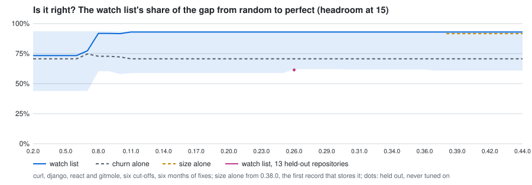
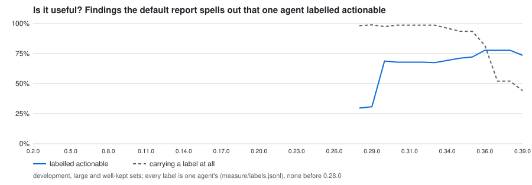
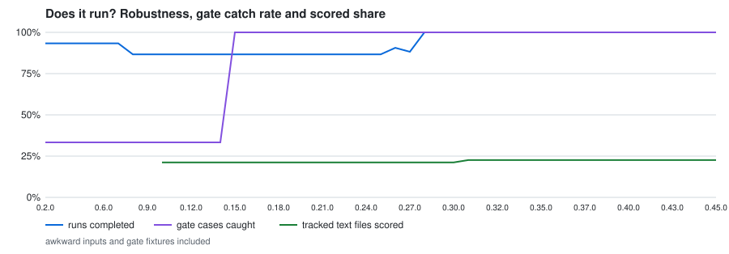
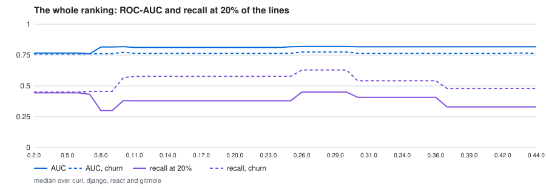
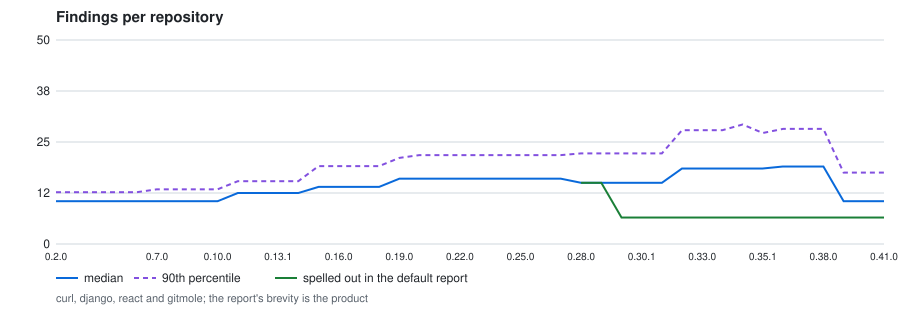
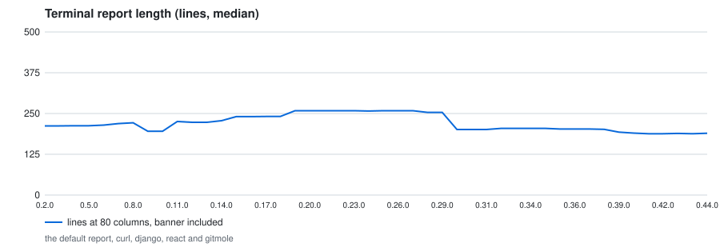
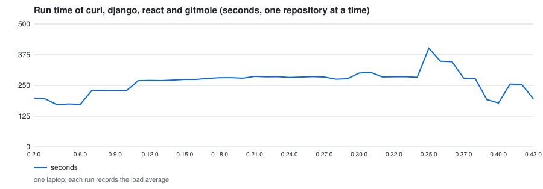
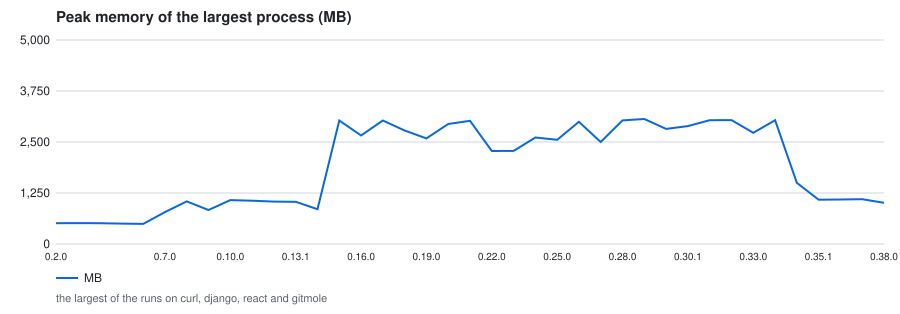

# Measurement history

Every measured release of gitmole, run through the harness of [measurement.md](https://github.com/antvinni/gitmole/blob/main/docs/measurement.md); back to [the README](https://github.com/antvinni/gitmole#readme). Regenerated by `python -m gitmole.measure report` from the records in [docs/measurements/](https://github.com/antvinni/gitmole/tree/main/docs/measurements). What the moves mean, and why a number moved, is read by hand in [measure/history-notes.md](https://github.com/antvinni/gitmole/blob/main/measure/history-notes.md).

## By release

Headroom is (hits − random) / (perfect − random) at 15, the median over the development repositories (and the large ones, in a release round), with a bootstrap interval over repositories. ▲ or ▼ marks a release whose value left the previous release's interval, the only move that counts. W/L/T is the watch list against churn alone at each cut-off. Bug magnets is how much more often the files the rule named were fixed again than unnamed files in the same deciles of the list's own score.

| release | headroom | churn | W/L/T | AUC | recall 20% | stable | magnets | findings | lines | scored | robust | gate | seconds | MB | note |
|---|---:|---:|---|---:|---:|---:|---:|---:|---:|---:|---:|---:|---:|---:|---|
| 0.2.0 | 0.73 [0.44, 0.94] | 0.71 | 9/1/8 | 0.77 | 44% | 1.00 | - | 10.5/12.7 | 212 | - | 14/15 | 1/3 | 199 | 510 | awkward-empty: subprocess.CalledProcessError: Command '['git', 'log', '--format=%ct'… |
| 0.3.0 | 0.73 [0.44, 0.94] | 0.71 | 9/1/8 | 0.77 | 44% | 1.00 | - | 10.5/12.7 | 212 | - | 14/15 | 1/3 | 195 | 512 | awkward-empty: subprocess.CalledProcessError: Command '['git', 'log', '--format=%ct'… |
| 0.4.0 | 0.73 [0.44, 0.94] | 0.71 | 9/1/8 | 0.77 | 44% | 1.00 | - | 10.5/12.7 | 212.5 | - | 14/15 | 1/3 | 172 | 509 | awkward-empty: subprocess.CalledProcessError: Command '['git', 'log', '--format=%ct'… |
| 0.5.0 | 0.73 [0.44, 0.94] | 0.71 | 9/1/8 | 0.77 | 44% | 1.00 | - | 10.5/12.7 | 212.5 | - | 14/15 | 1/3 | 175 | 499 | awkward-empty: subprocess.CalledProcessError: Command '['git', 'log', '--format=%ct'… |
| 0.6.0 | 0.73 [0.44, 0.94] | 0.71 | 9/1/8 | 0.77 | 44% | 1.00 | - | 10.5/12.7 | 214.5 | - | 14/15 | 1/3 | 173 | 492 | awkward-empty: subprocess.CalledProcessError: Command '['git', 'log', '--format=%ct'… |
| 0.7.0 | 0.77 [0.44, 0.94] | 0.75 | 9/1/8 | 0.76 | 43% | 1.00 | - | 10.5/13.4 | 219 | - | 14/15 | 1/3 | 230 | 783 | awkward-empty: subprocess.CalledProcessError: Command '['git', 'log', '--format=%ct'… |
| 0.8.0 | 0.92 [0.60, 0.94] | 0.73 | 13/0/5 | 0.81 | 30% | 1.00 | 2.31 | 10.5/13.4 | 221.5 | - | 13/15 | 1/3 | 230 | 1045 | awkward-empty: subprocess.CalledProcessError: Command '['git', 'log', '--format=%ct'…; awkward-shallow: 1 step(s) failed |
| 0.9.0 | 0.92 [0.60, 0.94] | 0.73 | 13/0/5 | 0.81 | 30% | 1.00 | 2.31 | 10.5/13.4 | 195.5 | - | 13/15 | 1/3 | 228 | 834 | awkward-empty: subprocess.CalledProcessError: Command '['git', 'log', '--format=%ct'…; awkward-shallow: 1 step(s) failed |
| 0.10.0 | 0.92 [0.58, 0.93] | 0.72 | 13/0/5 | 0.82 | 38% | 1.00 | 1.95 | 10.5/13.4 | 195.5 | 21% | 13/15 | 1/3 | 230 | 1075 | awkward-empty: subprocess.CalledProcessError: Command '['git', 'log', '--format=%ct'…; awkward-shallow: 1 step(s) failed |
| 0.11.0 | 0.93 [0.59, 0.93] | 0.71 | 13/0/5 | 0.81 | 38% | 1.00 | 2.00 | 12.5/15.4 | 225.5 | 21% | 13/15 | 1/3 | 269 | 1062 | awkward-empty: subprocess.CalledProcessError: Command '['git', 'log', '--format=%ct'…; awkward-shallow: 1 step(s) failed |
| 0.12.0 | 0.93 [0.59, 0.93] | 0.71 | 13/0/5 | 0.81 | 38% | 1.00 | 2.04 | 12.5/15.4 | 223 | 21% | 13/15 | 1/3 | 270 | 1038 | awkward-empty: subprocess.CalledProcessError: Command '['git', 'log', '--format=%ct'…; awkward-shallow: 1 step(s) failed |
| 0.13.1 | 0.93 [0.59, 0.93] | 0.71 | 13/0/5 | 0.81 | 38% | 1.00 | 2.04 | 12.5/15.4 | 223 | 21% | 13/15 | 1/3 | 270 | 1034 | awkward-empty: subprocess.CalledProcessError: Command '['git', 'log', '--format=%ct'…; awkward-shallow: 1 step(s) failed |
| 0.14.0 | 0.93 [0.59, 0.93] | 0.71 | 13/0/5 | 0.81 | 38% | 1.00 | 2.04 | 12.5/15.4 | 228 | 21% | 13/15 | 1/3 | 272 | 853 | awkward-empty: subprocess.CalledProcessError: Command '['git', 'log', '--format=%ct'…; awkward-shallow: 1 step(s) failed |
| 0.15.0 | 0.93 [0.59, 0.93] | 0.71 | 13/0/5 | 0.81 | 38% | 1.00 | 2.04 | 14/19.1 | 240.5 | 21% | 13/15 | 3/3 | 274 | 3026 | awkward-empty: subprocess.CalledProcessError: Command '['git', 'log', '--format=%ct'…; awkward-shallow: 1 step(s) failed |
| 0.16.0 | 0.93 [0.59, 0.93] | 0.71 | 13/0/5 | 0.81 | 38% | 1.00 | 2.04 | 14/19.1 | 240.5 | 21% | 13/15 | 3/3 | 274 | 2660 | awkward-empty: subprocess.CalledProcessError: Command '['git', 'log', '--format=%ct'…; awkward-shallow: 1 step(s) failed |
| 0.17.0 | 0.93 [0.59, 0.93] | 0.71 | 13/0/5 | 0.81 | 38% | 1.00 | 2.04 | 14/19.1 | 241 | 21% | 13/15 | 3/3 | 279 | 3026 | awkward-empty: subprocess.CalledProcessError: Command '['git', 'log', '--format=%ct'…; awkward-shallow: 1 step(s) failed |
| 0.18.0 | 0.93 [0.59, 0.93] | 0.71 | 13/0/5 | 0.81 | 38% | 1.00 | 2.04 | 14/19.1 | 241 | 21% | 13/15 | 3/3 | 281 | 2782 | awkward-empty: subprocess.CalledProcessError: Command '['git', 'log', '--format=%ct'…; awkward-shallow: 1 step(s) failed |
| 0.19.0 | 0.93 [0.59, 0.93] | 0.71 | 13/0/5 | 0.81 | 38% | 1.00 | 2.04 | 16/21.1 | 258.5 | 21% | 13/15 | 3/3 | 282 | 2588 | awkward-empty: subprocess.CalledProcessError: Command '['git', 'log', '--format=%ct'…; awkward-shallow: 1 step(s) failed |
| 0.20.0 | 0.93 [0.59, 0.93] | 0.71 | 13/0/5 | 0.81 | 38% | 1.00 | 2.04 | 16/21.8 | 258.5 | 21% | 13/15 | 3/3 | 280 | 2940 | awkward-empty: subprocess.CalledProcessError: Command '['git', 'log', '--format=%ct'…; awkward-shallow: 1 step(s) failed |
| 0.21.0 | 0.93 [0.59, 0.93] | 0.71 | 13/0/5 | 0.81 | 38% | 1.00 | 2.04 | 16/21.8 | 258.5 | 21% | 13/15 | 3/3 | 287 | 3020 | awkward-empty: subprocess.CalledProcessError: Command '['git', 'log', '--format=%ct'…; awkward-shallow: 1 step(s) failed |
| 0.22.0 | 0.93 [0.59, 0.93] | 0.71 | 13/0/5 | 0.81 | 38% | 1.00 | 2.04 | 16/21.8 | 258.5 | 21% | 13/15 | 3/3 | 285 | 2279 | awkward-empty: subprocess.CalledProcessError: Command '['git', 'log', '--format=%ct'…; awkward-shallow: 1 step(s) failed |
| 0.23.0 | 0.93 [0.59, 0.93] | 0.71 | 13/0/5 | 0.81 | 38% | 1.00 | 2.04 | 16/21.8 | 258.5 | 21% | 13/15 | 3/3 | 286 | 2282 | awkward-empty: subprocess.CalledProcessError: Command '['git', 'log', '--format=%ct'…; awkward-shallow: 1 step(s) failed |
| 0.24.0 | 0.93 [0.59, 0.93] | 0.71 | 13/0/5 | 0.81 | 38% | 1.00 | 2.04 | 16/21.8 | 257.5 | 21% | 13/15 | 3/3 | 283 | 2610 | awkward-empty: subprocess.CalledProcessError: Command '['git', 'log', '--format=%ct'…; awkward-shallow: 1 step(s) failed |
| 0.25.0 | 0.93 [0.59, 0.93] | 0.71 | 13/0/5 | 0.82 | 38% | 1.00 | 2.03 | 16/21.8 | 258.5 | 21% | 13/15 | 3/3 | 284 | 2553 | awkward-empty: subprocess.CalledProcessError: Command '['git', 'log', '--format=%ct'…; awkward-shallow: 1 step(s) failed |
| 0.26.0 | 0.93 [0.62, 0.93] | 0.71 | 12/0/6 | 0.82 | 45% | 1.00 | 2.06 | 16/21.8 | 258.5 | 21% | 29/32 | 3/3 | 286 | 2994 | awkward-empty: subprocess.CalledProcessError: Command '['git', 'log', '--format=%ct'…; awkward-shallow: 1 step(s) failed; gitmole: 9 step(s) failed |
| 0.27.0 | 0.93 [0.62, 0.93] | 0.71 | 12/0/6 | 0.82 | 45% | 1.00 | 2.06 | 16/21.8 | 258.5 | 21% | 15/17 | 3/3 | 284 | 2501 | awkward-empty: subprocess.CalledProcessError: Command '['git', 'log', '--format=%ct'…; awkward-shallow: 1 step(s) failed |
| 0.28.0 | 0.62 [0.36, 0.93] | 0.52 | 17/4/9 | 0.82 | 36% | 1.00 | 3.86 | 18.5/22 | 278 | 21% | 21/21 | 3/3 | 674 | 3029 |  |
| 0.29.0 | 0.62 [0.36, 0.93] | 0.52 | 17/4/9 | 0.82 | 36% | 1.00 | 3.86 | 18.5/22 | 278 | 21% | 21/21 | 3/3 | 680 | 3064 |  |
| 0.30.0 | 0.62 [0.36, 0.93] | 0.52 | 17/4/9 | 0.82 | 36% | 1.00 | 3.86 | 18.5/22 | 220.5 | 21% | 21/21 | 3/3 | 709 | 2821 |  |
| 0.30.1 | 0.62 [0.36, 0.93] | 0.52 | 17/4/9 | 0.82 | 36% | 1.00 | 3.86 | 18.5/22 | 220.5 | 23% | 21/21 | 3/3 | 718 | 2889 |  |
| 0.31.0 | 0.62 [0.36, 0.93] | 0.52 | 17/4/9 | 0.82 | 36% | 1.00 | 3.86 | 18.5/22 | 220.5 | 23% | 21/21 | 3/3 | 689 | 3034 |  |
| 0.32.0 | 0.62 [0.36, 0.93] | 0.52 | 17/4/9 | 0.82 | 36% | 1.00 | 3.86 | 23.5/27.5 | 224 | 23% | 21/21 | 3/3 | 697 | 3037 |  |
| 0.33.0 | 0.62 [0.36, 0.93] | 0.52 | 17/4/9 | 0.82 | 36% | 1.00 | 3.86 | 23.5/27.5 | 224 | 23% | 21/21 | 3/3 | 700 | 2725 |  |
| 0.34.0 | 0.62 [0.36, 0.93] | 0.52 | 17/4/9 | 0.82 | 36% | 1.00 | 3.86 | 23.5/27.5 | 224 | 23% | 21/21 | 3/3 | 691 | 3035 |  |
| 0.35.0 | 0.62 [0.36, 0.93] | 0.52 | 17/4/9 | 0.82 | 36% | 1.00 | 3.86 | 23.5/28.5 | 224 | 23% | 21/21 | 3/3 | 811 | 1500 |  |
| 0.35.1 | 0.62 [0.36, 0.93] | 0.52 | 17/4/9 | 0.82 | 36% | 1.00 | 3.86 | 23/27 | 220.5 | 23% | 21/21 | 3/3 | 812 | 1125 |  |
| 0.36.0 | 0.62 [0.36, 0.93] | 0.52 | 17/4/9 | 0.82 | 36% | 1.00 | 3.86 | 23.5/28 | 220.5 | 23% | 21/21 | 3/3 | 766 | 1130 |  |
| 0.37.0 | 0.65 [0.46, 0.83] | 0.58 | 35/10/15 | 0.79 | 27% | 1.00 | 3.29 | 19.5/25.8 | 216 | 35% | 26/26 | 3/3 | 414 | 1239 | large set run, not in the previous release |
| 0.38.0 | 0.60 [0.41, 0.80] | 0.55 | 46/13/25 | 0.78 | 34% | 1.00 | 3.24 | 19.5/25.8 | 216 | 35% | 26/26 | 3/3 | 358 | 1034 |  |
| 0.39.0 | 0.60 [0.41, 0.80] | 0.55 | 46/13/25 | 0.78 | 34% | 1.00 | 3.24 | 11/16.9 | 209 | 35% | 26/26 | 3/3 | 350 | 995 |  |
| 0.40.0 | 0.60 [0.41, 0.80] | 0.55 | 46/13/25 | 0.78 | 34% | 1.00 | 3.31 | 11/16.9 | 204 | 35% | 26/26 | 3/3 | 330 | 1004 |  |

## How a release is measured

Each release runs from its own source over the development set (medium repositories, one or more per ecosystem, and gitmole itself; `development_criterion` in measure/corpus.json), the large set in a release round, the awkward inputs and the gate fixtures, one repository at a time, with the reference date fixed at 2026-09-17. What it produces is scored by the current definitions, which stay fixed across the history: the ranking is the release's own, rebuilt at six cut-offs by its own backtest, and the outcome is the files a fix commit touched in the six months after each cut-off. The holdout is not read here: it runs only for the release a note claims is more effective. A release that crashed or timed out on a development or large repository is drawn at the bottom of every graph with a red cross, and its row says why. The graphs draw every release over the same four repositories, curl, django, react and gitmole, so a repository joining the development set is not a move; the table and the dashboard use the whole set: cost over the development set, effectiveness over development and large, and well-kept where a release round ranked it. Robust counts every set a round ran, so its denominator is larger in a release round. The first three graphs are the ones the README shows: is the ranking right, are the findings worth acting on, does it run.

## The dashboard for 0.40.0

| | set | value |
|---|---|---|
| median headroom at 15 | holdout | not run for this record |
| median headroom at 15 | development, large and well-kept | 0.60 |
| recall at 20% of lines | development, large and well-kept | 34% |
| top-15 stability over 50 commits | development, large and well-kept | 1.00 |
| top-15 carried over from one cut-off to the next, six months | development, large and well-kept | 0.90 |
| top-15 hits above the better of churn and size, summed over cut-offs (information) | development, large and well-kept | 1 over 84 cut-offs (27 ahead, 26 behind, 31 level) |
| saturated cut-offs, half the pool or more fixed (information) | development, large and well-kept | 1 of 84 |
| findings per repository, median and p90 | development | 11 and 16.9 |
| findings the default report spells out that are labelled actionable | development, large and well-kept | 71% of 123, 39% labelled |
| rules sound, broken and undecided | labelled sample | broken 3, sound 3, undecided 26, unlabelled 7 |
| repositories with a critical labelled false | well-kept | 0 of 4 fired a critical |
| wall time and peak memory | development | 330 s, 1004 MB |
| wall time and peak memory | large | 404 s, 1135 MB |
| scored share of tracked files | development | 35% |
| findings whose text agrees with their own numbers | every set | 213 of 213 |
| contradictions between a finding and the report's own facts | every set | 53 (secrets_headline 1, self_credit 51, unreferenced_named 1) |
| unexplained description disagreements | development | not run |

